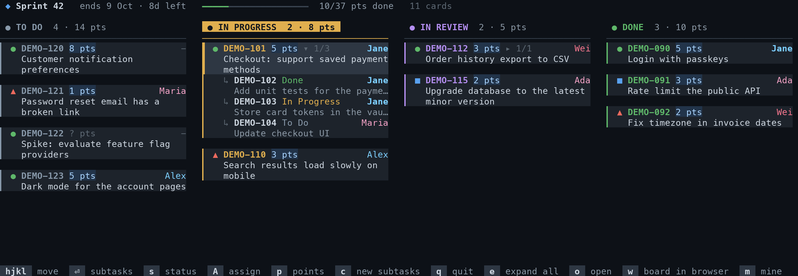

# jboard

Your active Jira sprint as an interactive kanban board in the terminal.



- **The board you know**: the columns, statuses and story points of your Jira board, one card per story with its subtasks folded underneath
- **Work without the browser**: change status, assign people, set story points and create subtasks from the keyboard
- **No build, no dependencies**: TypeScript that Node runs directly, so there is no build step and no `npm install` needed to use it

## Requirements

- **Node.js 22.18 or newer** (runs TypeScript directly)
- **Jira Server or Data Center** with a [personal access token](https://confluence.atlassian.com/enterprise/using-personal-access-tokens-1026032365.html).
  Jira Cloud is not supported yet: it uses basic auth with an API token instead of bearer tokens.

## Install

```sh
git clone https://github.com/niklaskors/jboard.git
ln -s "$PWD/jboard/bin/jboard.ts" ~/.local/bin/jboard   # any directory on your PATH
```

The link must point at `bin/jboard.ts` inside the clone (not a copy of it): it loads the rest of the code from `src/`.
To update, `git pull` in the clone.

Then set the environment, for example in `~/.zshrc`:

```sh
export JIRA_SERVER="https://jira.example.com/jira"   # base URL of your Jira
export JIRA_API_TOKEN="..."                           # Profile → Personal Access Tokens
export JIRA_BOARD_ID=123                              # the rapidView=123 in your board's URL
```

## Usage

```sh
jboard              # interactive board for the active sprint
jboard -m           # only cards assigned to me (or with a subtask of mine)
jboard -p           # print the board once, e.g. to pipe it somewhere
jboard -w           # open the board in the browser
jboard -t day       # light theme
jboard -h           # all options
```

### Keys

| Key | Action |
|---|---|
| `h` `j` `k` `l` / arrows | Move between columns and cards |
| `g` / `G` | Top / bottom of the column |
| `Enter` / `Space` | Show or hide a story's subtasks |
| `e` | Show or hide all subtasks |
| `s` | Change status (the transitions your workflow allows) |
| `A` | Assign: your team first, type to search everyone |
| `p` | Set story points (empty clears them) |
| `c` | Create subtasks: type or paste a list, one per line, `Ctrl+S` to create |
| `o` / `w` | Open the selected issue / the board in the browser |
| `m` | Toggle "only mine" |
| `a` | Show all done cards instead of the latest 5 |
| `r` | Reload from Jira |
| `q` / `Esc` | Quit |

Dialogs filter as you type; `Esc` closes them without changing anything.

## Configuration

| Variable | Meaning |
|---|---|
| `JIRA_SERVER` | Base URL of your Jira (required) |
| `JIRA_API_TOKEN` | Personal access token, sent as a bearer token (required) |
| `JIRA_BOARD_ID` | Board to show; or pass `--board <id>` |
| `JBOARD_THEME` | `night` (default), `day` or `classic` |
| `JIRA_SSO_URL` | Page that redoes your single sign-on, see below (default: `$JIRA_SERVER/login.jsp`) |
| `JBOARD_TRUECOLOR` | Set to `1` to force 24-bit colour if your terminal supports it but doesn't say so |

Story points come from the field your board estimates with, so the totals match the web board.

### Single sign-on

Some Jira setups with SAML single sign-on stop accepting a valid token until you sign in again in the browser
(the API then answers `403 Client must have sufficient permissions`). jboard handles this itself:
it opens `JIRA_SSO_URL` in your browser in the background, waits until the token works again, and carries on.
If `login.jsp` doesn't start your sign-in, point `JIRA_SSO_URL` at the page that does,
for example `$JIRA_SERVER/plugins/servlet/samlsso` for the resolution SAML SSO app.

### Errors

Failed requests are logged with their response headers to `~/.cache/jboard/errors.log`.

## Development

```sh
npm install      # TypeScript and Node types, only needed for type checking
npm run check    # strict type check
```

Node only strips types, so jboard can only use erasable TypeScript syntax (no enums, namespaces or parameter properties)
and imports must name the `.ts` file; `tsconfig.json` enforces both.

### Project layout

```
bin/jboard.ts          entry point
src/cli.ts             options, help text, startup
src/config.ts          settings from the environment
src/browser.ts         opening URLs on macOS, Linux and Windows
src/board.ts           the sprint: columns, cards with their subtasks, story points
src/jira/client.ts     HTTP: bearer token, retries, error log, SSO re-sign-in
src/jira/api.ts        Jira operations: transitions, assigning, fields, bulk-creating subtasks
src/jira/types.ts      the Jira data jboard uses
src/render/line.ts     styled text lines: wrapping, fitting, overlaying
src/render/theme.ts    the night, day and classic themes
src/render/layout.ts   cards, column headers and the sprint header
src/render/print.ts    the printed board (-p)
src/tui/app.ts         the interactive board: navigation, drawing, keys
src/tui/dialog.ts      the dialog interface and box drawing
src/tui/picker.ts      filter-as-you-type list used by assign and status
src/tui/assign.ts      A: assign
src/tui/status.ts      s: change status
src/tui/points.ts      p: story points
src/tui/subtasks.ts    c: create subtasks
```

A new dialog implements `Dialog` (`draw` and `key`) and gets a `DialogHost` to show messages and run Jira changes;
`src/tui/points.ts` is the smallest example.

## License

[MIT](LICENSE)
